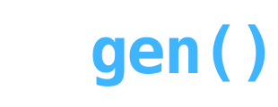

<p align="center">
  <picture>
    <source media="(prefers-color-scheme: dark)" width="300" srcset="docs/tgen_logo_white.svg">
    <source media="(prefers-color-scheme: light)" width="300" srcset="docs/tgen_logo_black.svg">
    
  </picture>
</p>

<p align="center">
    <em>Testcase generation for random inputs.</em>
</p>

<p align="center">
	<a href="https://opensource.org/license/mit" target="_blank" rel="noopener noreferrer nofollow" style="display:inline-block"></a>
	<a href="https://github.com/brunomaletta/tgen/blob/main/single_include/tgen.h" target="_blank" rel="noopener noreferrer nofollow" style="display:inline-block"></a>
	<a href="https://github.com/brunomaletta/tgen/tree/main/tests" target="_blank" rel="noopener noreferrer nofollow" style="display:inline-block"></a>
	<a href="https://brunomaletta.github.io/tgen/index.html" target="_blank" rel="noopener noreferrer nofollow" style="display:inline-block"></a>
</p>

---

## 🎯 Overview

`tgen` is a C++ header for writing random testcase generators quickly and safely.

Instead of manually coding ad-hoc generators, use powerful algorithmic machinery to guarantee simple, correct generation—with uniform sampling where the API promises it.

There is support for lists, permutations, math, and more.

---

## ⚡ Quick examples

`tgen` provides complementary kinds of generation:

- **Direct generation**: sample and operate on data directly.

```cpp
// Generates all primes in [1, 10] in order.
std::cout << tgen::distinct(tgen::math::gen_prime, 1, 10).gen_all().sort() << std::endl;

// Generates a random valid parenthesis sequence of size 10.
std::cout << tgen::misc::gen_parenthesis(10) << std::endl;

// Generates a random simple polygon with 200 vertices in [0, 2000] x [0, 2000].
std::cout << tgen::print(tgen::geometry::random_simple_polygon(200, 0, 2000), '\n') << std::endl;
```

- **Generators**: describe constraints and sample uniformly among valid values.

```cpp
// Generates 20 random distinct values from 1 to 100.
std::cout << tgen::list<int>(20, 1, 100).all_different().gen() << std::endl;

// Generates all palindromic DNA sequences of length 3.
std::cout << tgen::str(3, {'A', 'C', 'G', 'T'}).palindrome().gen_all() << std::endl;

// Generates a random permutation with a single cycle.
std::cout << tgen::permutation(5).cycles({5}).gen().add_1() << std::endl;

// Generates q distinct range queries.
std::cout << tgen::pair(1, n).leq().distinct().gen_list(q) << std::endl;

// Random skewed tree on 10 vertices (elongation 3; large diameter).
std::cout << tgen::tree::gen_skewed(10, 3) << std::endl;

// Random connected simple graph on 8 vertices and 10 edges, including (0,1).
std::cout << tgen::graph(8, 10).add_edge(0, 1).get_connected() << std::endl;
```

- **Adversarial generation**: generate worst-case inputs.

```cpp
// Worst case for Edmonds-Karp and Dinitz.
std::cout << tgen::hack::dinitz_worst_case(100, 100).print_nm();

// Generates array that forces collision on std::unordered_set.
std::cout << tgen::print(tgen::hack::std_unordered(1e6)) << std::endl;

// Two binary strings with the same polynomial hash (base 31, mod 1e9+7).
std::cout << tgen::print(tgen::hack::polynomial_hash_hack(2, 31, 1e9+7), '\n') << std::endl;
```

No loops. No backtracking. No custom generator code.

---

## ⚖️ Why not [testlib](https://github.com/MikeMirzayanov/testlib) / [jngen](https://github.com/ifsmirnov/jngen)?

`tgen` works similarly to traditional generators, but provides:
- **Declarative generators** to express complex constraints concisely;
- **Adversarial generation** to create worst-case inputs for known algorithms;
- **Built-in distinct generation** for duplicate-free, unbiased generation;
- **Uniform sampling** for constraint-based generators (`.gen()`, `.gen_all()`) and distinct machinery; some helpers (e.g. skewed trees/graphs, biased geometry) are intentionally non-uniform;
- **Comprehensive documentation** with many examples.

## 📦 Installation

Header-only. Download

```bash
wget https://raw.githubusercontent.com/brunomaletta/tgen/main/single_include/tgen.h
```

and include

```cpp
#include "tgen.h"
```

---

## 🎲 Generation

Similar to traditional generators, there is registration and opts (arguments).

```cpp
int main(int argc, char** argv) {
    tgen::register_gen(argc, argv);
    int n = tgen::opt<int>("n");
    std::cout << tgen::permutation(tgen::next(1, n)).gen().add_1() << std::endl;
}
``` 

We can run with `n=100` by calling `./gen -n 100`.

---

## 📚 Documentation

<a href="https://brunomaletta.github.io/tgen/index.html">

</a>

